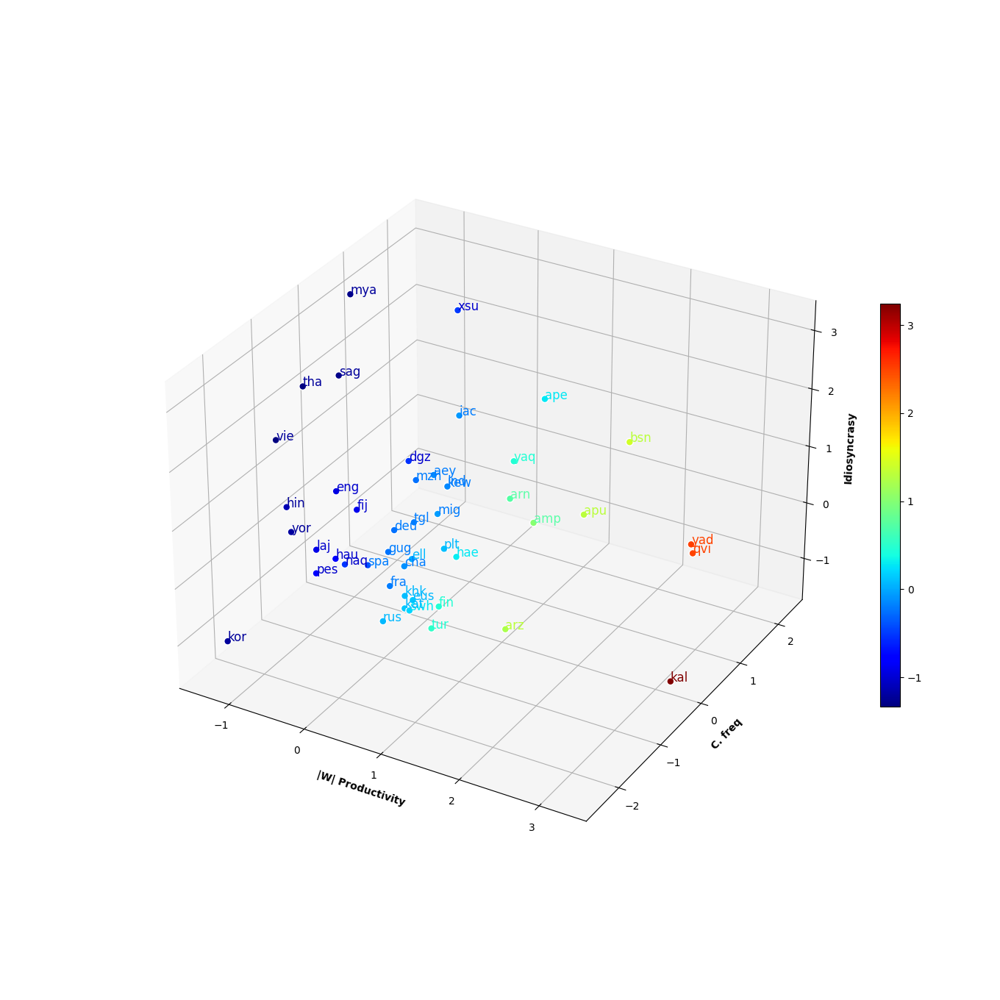

# Languages through the looking glass of BPE compression

(under construction)

 - `scripts/` Set of scripts for processing the text, and extracting productivity measures for the subwords obtained at each merge.
 - `outputs/` It contains  the outputs of the scripts
 - `notebooks/` These notebooks plot the BPE Space, do the  clustering, and  do some further analysis (using the generated data in outputs/) .

